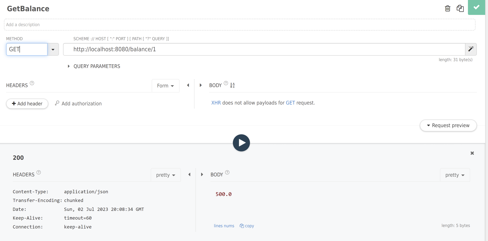
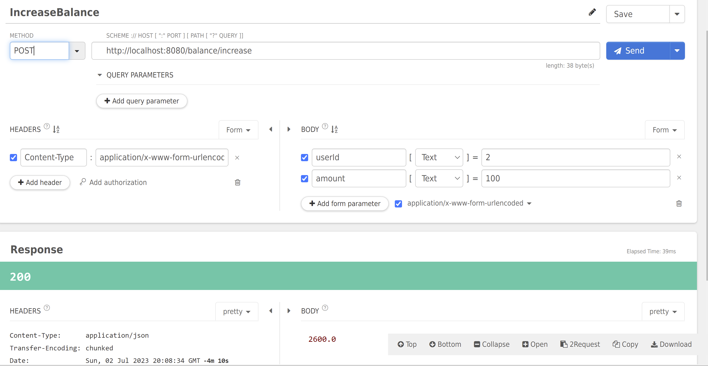
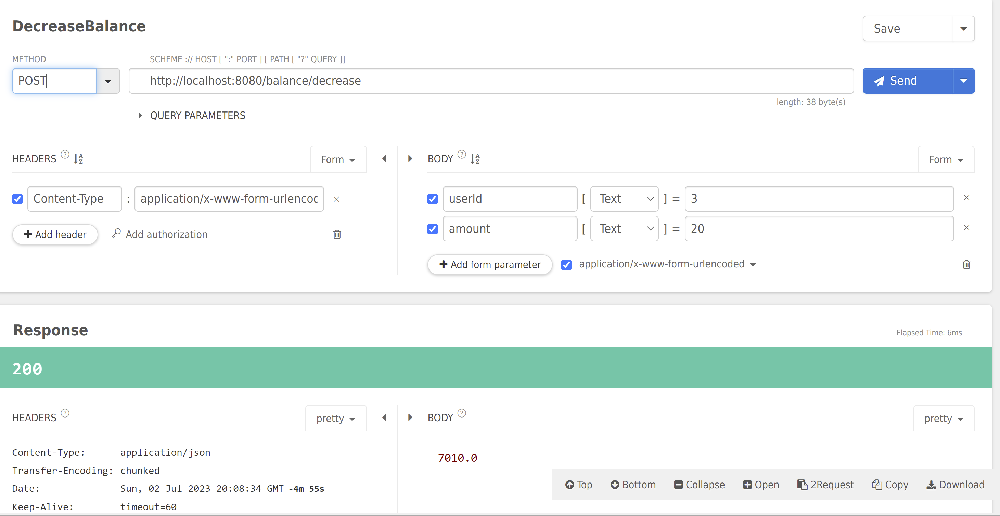

# Java проект - Баланс пользователя

## Стэк используемых технологий
- Spring Boot
- H2 база данных
- Начальная инициализация бд из src/main/resources/data.sql

## Спецификация API
- Получить баланс пользователя **GET /balance/{userId}**
- Уменьшить баланс пользователя **POST /balance/decrease**
- Увеличить баланс пользователя **POST /balance/increase**

## Переход в консоль базы данных H2
http://localhost:8080/h2-console

## Схема базы данных
Одна таблица с записями с текущим балансом пользователя
user_balance
Поля:
user_id,
balance

## API запросы в Talend API Tester:
### Получить баланс пользователя:

### Увеличить баланс пользователя:

### Уменьшить баланс пользователя

